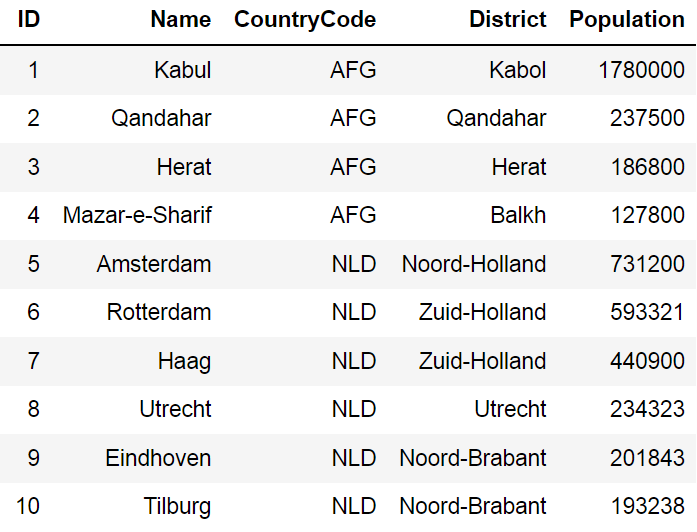
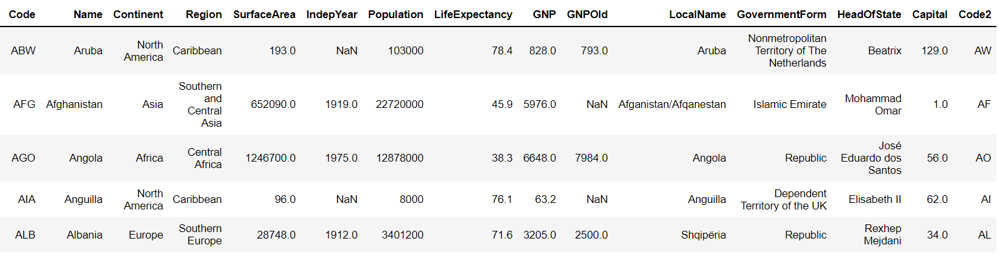
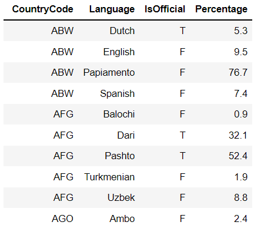

# SQL Queries
* SQL practice with world database.  

## world database
* **city**  
  

* **country**  
  

* **country language**  
  

## SQL Practice
In sql-queries.sql you will find a practice with world database of the most relevant SQL queries.

## SQL commands
* Data Manipulate Language (DML)
* Data Definition Language (DDL)
* Data Control Language (DCL)
* Transaction Control Language (TCL)  

  

## SQL JOINS
* Inner join
* Left join
* Right join
* Full join  

  

## AGGREGATE FUNCTIONS
* AVG()
* COUNT()
* MIN()
* MAX()
* SUM()   

 