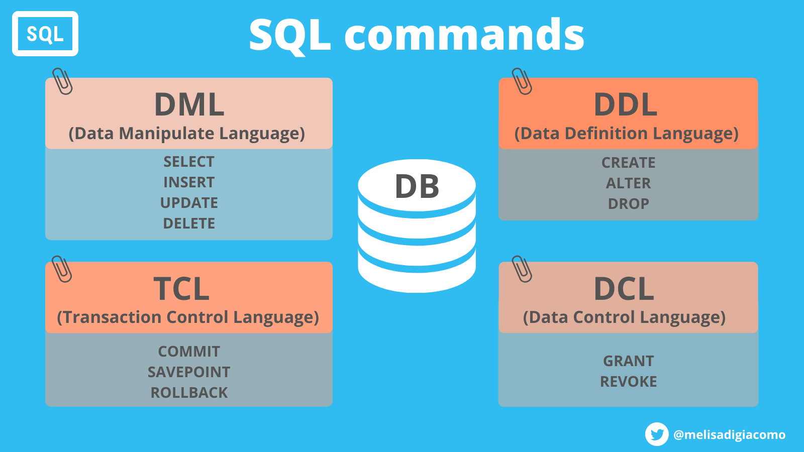
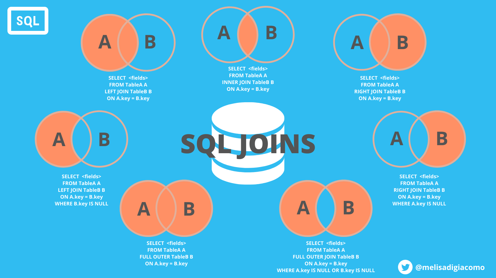
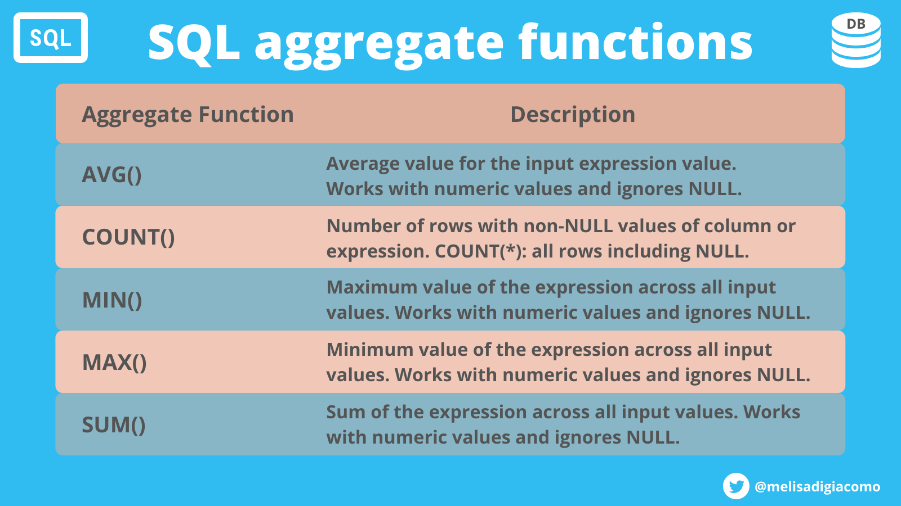

# SQL queries

A repo with a collection of SQL queries.  

## [sql_introduction.sql](sql_introduction.sql)
DDL, DML SQL commands and some built-in SQL functions.

## [sql-queries.sql](sql-queries.sql)
A practise with world database of the most relevant SQL queries.

## [sql_practise.sql](sql_practise.sql)
Another practise with more SQL queries. Joins, subqueries, triggers, stored procedures, views and Windows functions.

## SQL commands
* Data Manipulate Language (DML)
* Data Definition Language (DDL)
* Data Control Language (DCL)
* Transaction Control Language (TCL)  

  

## SQL JOINS
* Inner join
* Left join
* Right join
* Full join  

  

## AGGREGATE FUNCTIONS
* AVG()
* COUNT()
* MIN()
* MAX()
* SUM()   

 